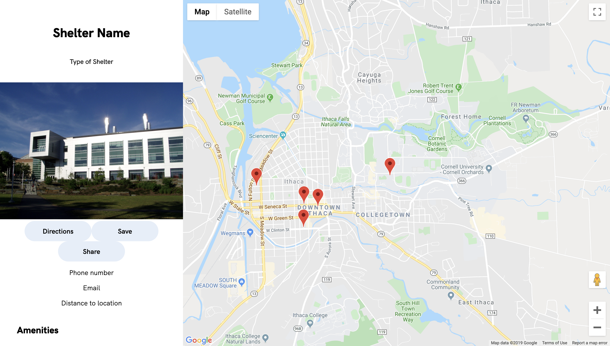

# ShelterMe
Created by: Avani Aggrwal, Jimena Fernández, Gracie Jing, Olivia Zhu

**Find or offer shelter in times of natural disasters.**

ShelterMe is a web app created to help people in the face of natural disasters. People have the ability to choose whether they are searching for shelter or offering shelter.

People searching for shelter have the ability to enter their location and preferred range for traveling in addition to other parameters. They are then presented with a map showing various shelters. This map will show directions to the shelter as well as information about the shelter like contact information and available space.

People offering shelter have the ability to enter their location, the number of people they can accommodate, meals they can supply, the duration that they can accommodate, as well as special needs they can accommodate. They are then presented with a summary of all of their information they have entered.

Looking for Shelter User Flow
1. Home Screen

2. Identify User Type

3. Identify Current Location

4. Identify Party Size

5. Identify Ideal Travel Distance

6. Display Results on Google Maps that Fit Criteria

